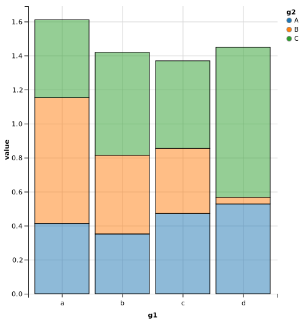
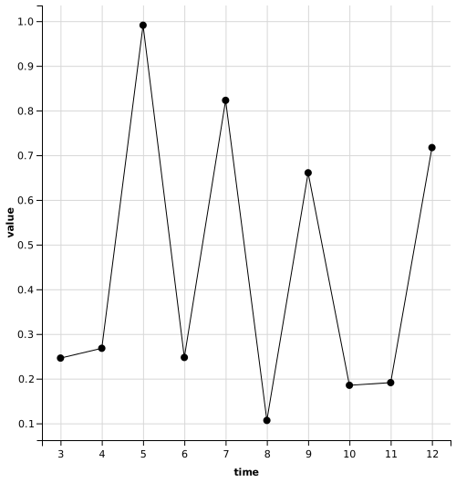
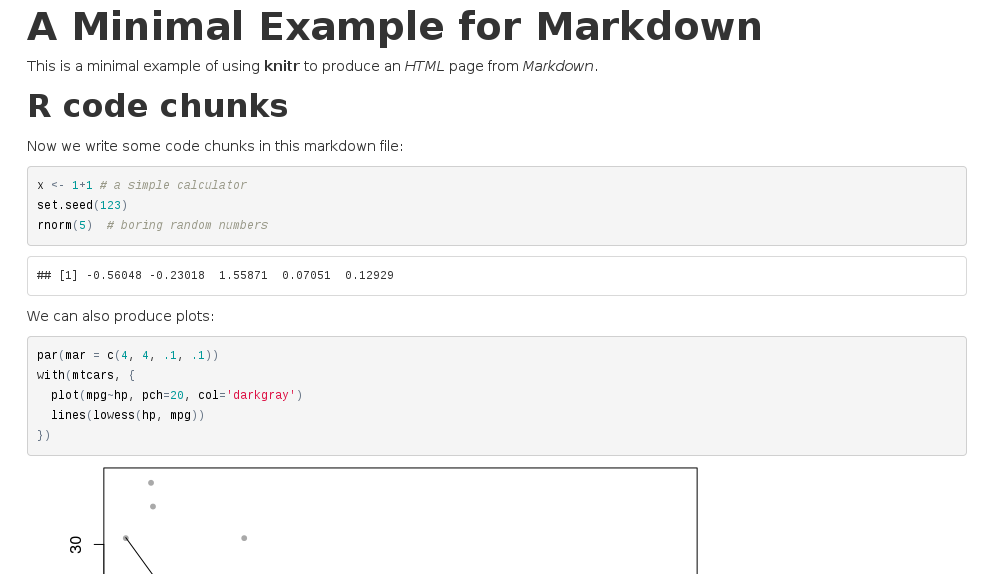

---
title       : R reports
subtitle    : Generating reproducible reports with R
author      : Bo Werth
job         : Statistician STI/EAS
framework   : io2012        # {io2012, html5slides, shower, dzslides, ...}
highlighter : highlight.js  # {highlight.js, prettify, highlight}
hitheme     : tomorrow      # {arta, ascetic, brown_paper, dark, default, far, github, googlecode, hemisu-light, idea, ir_black, magula, monokai, pojoaque, school_book, solarized_dark, solarized_light, sunburst, tomorrow_night, vs, xcode, zenburn}
widgets     : []            # {mathjax, quiz, bootstrap}
mode        : selfcontained # {standalone, draft}
knit        : slidify::knit2slides
# ext_widgets : {rCharts: [libraries/nvd3]}
# ext_widgets : {rCharts: [libraries/nvd3, libraries/highcharts]}
ext_widgets : {rCharts: [libraries/highcharts, libraries/nvd3]}

--- &twocol

## Motivation

*** =left
### +
- quality: reproducibility, calculations
- efficiency gains: scaling
- output flexibility: PDF, Word, HTML

*** =right
### -
- development time
- changing requirements
- maintenance and transparency

--- .class #id

## About `R`

- statistical programming
- open-source
- object-oriented
- steep learning curve
- from user to developer
- powerful graphics, e.g. `ggplot` package
- reproducible reports, e.g. `knitr` package

<p style="text-align:right"></p>

--- .class #id

### Graphics

- `ggplot`: implementation of Tufte's "grammar of graphics"
 - `qplot()`: single line of code
 - `ggplot()`: combine layers with '+'
- `gridSVG`: animate ggplot objects
- `ggvis`: `ggplot` for dynamic charts based on `vega.js`
- `rCharts`: interface to various `d3.js` libraries

--- .class #id

### ggplot2: `qplot()`

```{r echo=FALSE, message=FALSE}
require(ggplot2)
```

```{r message=FALSE, fig.height=6.5, fig.width=10}
qplot(x=price, y=carat, colour=clarity, data=diamonds, geom=("point"))
```

--- .class #id

### ggplot2: `ggplot()`

```{r message=FALSE, fig.height=6, fig.width=14}
ggplot(data=diamonds) + geom_point(aes(x=price, y=carat, colour=color)) + 
       facet_grid(. ~ clarity)
```

--- .class #id

### gridSVG: gapminder

<p style="text-align:center"></p>

--- .class #id

### gridSVG: rnd

<p style="text-align:center"></p>

--- &twocol

### ggvis: `/demo/dynamic.r`

*** =left
### dynamic stacked bars
<p style="text-align:center"></p>

*** =right
### moving data points
<p style="text-align:center"></p>

--- .class #id

### rCharts: nvd3 Sparklines

```{r echo = FALSE}
require(rCharts)
```

```{r echo = TRUE, results = 'asis'}
p2 <- nPlot(uempmed ~ date, data = economics, type = 'sparklinePlus')
p2$chart(xTickFormat="#!function(d) {return d3.time.format('%b %Y')(new Date( d * 86400000 ));}!#")
p2$print('chart2')
```

--- .class #id

### rCharts: highcharts

```{r echo = TRUE, results = 'asis', warning=FALSE}
p3 <- hPlot(Pulse ~ Height, data = MASS::survey, type = "bubble", title = "Zoom demo", 
            subtitle = "bubble chart", size = "Age", group = "Exer")
p3$chart(zoomType = "xy"); p3$exporting(enabled = T); p3$print('chart3')
```

--- .class #id

## Reporting with `knitr`

- use `rmarkdown` syntax
- generate charts from data, e.g. using `ggplot`
- include key figures in narrative, e.g. descriptive statistics
- convert to various output formats (Word, PDF, HTML)

<p style="text-align:right"></p>

--- .class #id

### Reporting with `knitr`

<p style="text-align:left"></p>

--- .class #id

### Reporting with `knitr`

```{r, eval=FALSE}
# A Minimal Example for Markdown
This is a minimal example of using **knitr** to produce an _HTML_ page from _Markdown_.
## R code chunks
Now we write some code chunks in this markdown file:
'''{r computing}
x <- 1+1 # a simple calculator
set.seed(123)
rnorm(5)  # boring random numbers
'''
We can also produce plots:
'''{r graphics}
par(mar = c(4, 4, .1, .1))
with(mtcars, {
  plot(mpg~hp, pch=20, col='darkgray')
  lines(lowess(hp, mpg))
})
'''
```

--- .class #id

## Report Templates

`brew`: generate input files for `knitr`

apply function to country vector

```{r eval=FALSE}
create.report <- function(x, prepend = "report_icio_tiva_") {
  Rmd.file <- file.path(path.Rmd, paste0(prepend, x, ".Rmd"))
  rmd.file <- file.path(path.rmd, paste0(prepend, x, ".rmd")) # .md doesn't convert hash tags
  brew(file = file.path(path, "report_icio_tiva.brew"), output = Rmd.file)
  knit(input = Rmd.file, output = rmd.file)
  out.file <- paste0(prepend, x, ".rmd")
  return(out.file)
}
coulist <- c("AUT", "DEU", "ESP", "IRL", "USA")
results <- sapply(as.character(coulist), create.report)
```

--- .class #id

### `brew` template example

```{r eval=FALSE}
'''{r preamble, echo = FALSE}
cou <<- '<%= x %>'
country <- as.character(namereg$country[match(cou, namereg$cou)])
natnlty <- as.character(namereg$coupron[match(cou, namereg$cou)])
customtext <- cntext[,colnames(cntext)==cou]
'''
# Trade in Value-added: 'r country'
## EXGRDVA\_EX {#exgrdvaex}
### Domestic value added content of gross exports, 'r year', %
'''{r fig1, fig.path="figures/report_icio_tiva/<%= x %>/", fig.height=5, fig.width=10, 
      echo=FALSE, message=FALSE}
	source(file.path(path, "code", "figure1.R"))
'''
'r country' domestic value-added content of its exports is, at 'r .perc1'%, 'r .rel1' 
the OECD average in 'r year'.
'r if(!is.na(customtext[1])) customtext[1]'
```

--- .class #id

## Reporting Tools and Platforms

[ReporteRs](http://davidgohel.github.io/ReporteRs/index.html): create MS doc and ppt with editable graphics and formatted tables

<p style="text-align:left"></p>

[rapporter](http://rapporter.net) / [pander](http://rapporter.github.io/pander/): ruby on rails online platform for report generation

<p style="text-align:left"></p>

[jekyll](http://jekyllrb.com/): ruby on rails framework to generate static homepages from `rmd` files (i.e. evaluate R code with `knitr`, see http://10.101.26.220, http://r-pkgs.had.co.nz/ or http://adv-r.had.co.nz)
