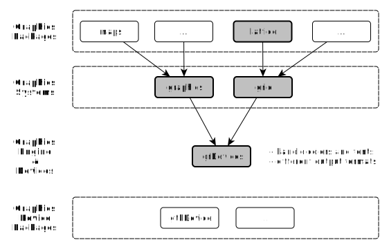
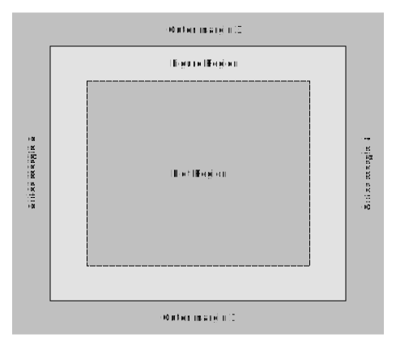
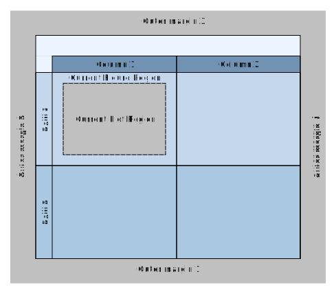
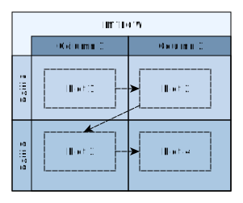
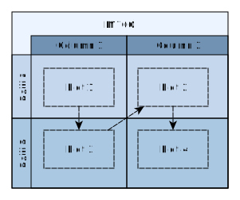
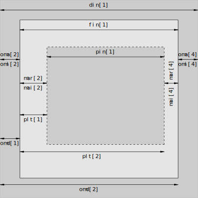

---
title       : R Graphics
subtitle    : Generating graphics for statistical analysis using R
author      : Bo Werth
job         : Statistician STI/EAS
framework   : io2012        # {io2012, html5slides, shower, dzslides, ...}
highlighter : highlight.js  # {highlight.js, prettify, highlight}
hitheme     : tomorrow      # {arta, ascetic, brown_paper, dark, default, far, github, googlecode, hemisu-light, idea, ir_black, magula, monokai, pojoaque, school_book, solarized_dark, solarized_light, sunburst, tomorrow_night, vs, xcode, zenburn}
widgets     : []            # {mathjax, quiz, bootstrap}
mode        : selfcontained # {standalone, draft}
knit        : slidify::knit2slides
ext_widgets : {rCharts: [libraries/highcharts, libraries/nvd3]}
bibliography: "references.bib"
csl         : "ecology.csl"

--- &twocol

```{r echo=FALSE, message=FALSE}
require(cluster)
require(ggplot2)
require(graphics)
require(grDevices) # for colours
require(rCharts)
require(stats)
```

## Graphics in statistical software

*** =left
programming
  - quality: reproducibility, calculations
  - efficiency gains: scaling
  - output flexibility: PDF, Word, HTML

*** =right
interactive creation (e.g. Excel, Tableau)
  - development time
  - changing requirements
  - maintenance and transparency

--- &twocol

## `R` Graphics Systems

*** =left
traditional graphics
  - graphics facilities of the S language
  - fast, intuitive
  - create plot with high-level function
  - add elements with low-level functions

*** =right
grid graphics system
  - produce complete plots
  - ideal proportions
  - facetting or multi-panel conditioning
  - `trellis`, `lattice`, `ggplot`

--- .class #id

## The organization of `R` graphics

<p style="text-align:center"></p>

--- .class #id

#### Publication quality graphics with `ggplot`

- implementation of Leland Wilkinson's "grammar of graphics" (2005)  
- independent components that can be composed in different ways
- not limited to a set of pre-specified graphics
- create new graphics that are precisely tailored

#### Interactive Graphics using JavaScript

- `ggvis`: `ggplot` for dynamic charts based on `vega.js`
- `rCharts`: interface to high-level js libraries building e.g. on `d3.js`
  - `highcharts`, `polyplot`, `nvd3`, `ricksaw` for statistical charts
  - `crosslet`, `datamaps`, `leaflet` etc. for map visualisations

--- .class #id

### traditional S-PLUS graphics

  - pen on paper model:
    - can only draw on top of the plot
    - cannot modify or delete existing content
  - no (user accessible) representation of the graphics
  - includes both tools for drawing primitives and entire plots
  - generally fast, but have limited scope


--- .class #id

### traditional S-PLUS graphics: `example(plot)`

```{r echo=FALSE, fig.height=8, fig.width=12, message=FALSE}
	
	op <- par(mfrow = c(2, 2), # 2 x 2 pictures on one plot
		      pty = "s",
		      mar = c(3, 0, 0, 0))

	plot(cars)
	lines(lowess(cars))

	plot(sin, -pi, 2*pi) # see ?plot.function

        ## Discrete Distribution Plot:
	plot(table(rpois(100, 5)), type = "h", col = "red", lwd = 10)

        ## Simple quantiles/ECDF, see ecdf() {library(stats)} for a better one:
	plot(x <- sort(rnorm(47)), type = "s")
	points(x, cex = .5, col = "dark red")

	par(op)
```

--- &twocol

### traditional S-PLUS graphics: plot regions

*** =left
Single plot regions



*** =right
Multiple plot regions



--- .class #id

### traditional S-PLUS graphics: plot regions

```{r eval=FALSE, echo=TRUE}
op <- par(mfrow = c(2, 2),
	      mar = c(3, 0, 0, 0))
plot(...); plot(...); plot(...); plot(...)
## At end of plotting, reset to previous settings:
par(op)
```

- the documentation can be looked up with `?par()`
- margins are measured in multiples of lines of text
- modifying traditional graphics state settings via `par()` has a persistent effect

--- &twocol

### traditional S-PLUS graphics: plot regions

```{r eval=FALSE, echo=TRUE}
op <- par(mfrow = c(2, 2),
	      mar = c(3, 0, 0, 0))
plot(...); plot(...); plot(...); plot(...)
## At end of plotting, reset to previous settings:
par(op)
```

- `mfrow` and `mfcol` control the number of figure regions on a page

*** =left



*** =right



--- &twocol

### traditional S-PLUS graphics: controlling plot regions

*** =left



*** =right
- diagram for controlling widths and horizontal locations
- plot region = figure region - figure margins
- `plt`: location of the plot region (l, r, b, t)
- `pin`: size of the plot region, (width, height)
- `pty`: `m`: use all available space, `s`: preserve square format

--- .class #id

### traditional S-PLUS graphics: colors and colours

```{r eval=TRUE, echo=TRUE}
colours()[1:4] # 657 color names
col2rgb("transparent") # see the RGB values for a particular color name
rgb(1, 0, 0) # Red-Green-Blue triplet of intensities, format #RRGGBB, FF = 255
```

--- .class #id

### traditional S-PLUS graphics: `pch` point symbols


A particular data symbol is selected by specifying an integer between 0 and 25 or a single character for the `pch` graphical setting. In the diagram, the relevant integer or character `pch` value is shown in grey to the left of the relevant symbol.

Source: http://vis.supstat.com/2013/04/plotting-symbols-and-color-palettes/

--- &twocol

### traditional S-PLUS graphics

*** =left
example(barplot)

```{r echo=FALSE, message=FALSE}
tN <- table(Ni <- stats::rpois(100, lambda = 5))
barplot(tN, 
	main = "poisson distribution, n = 100, lambda = 5",
	col = gray.colors(length(tN)))
```

*** =right
example(boxplot)

```{r echo=FALSE, message=FALSE}
rb <- boxplot(decrease ~ treatment, data = OrchardSprays, col = "bisque",
	main = "potency of constituents of orchard sprays")
# title("Comparing boxplot()s and non-robust mean +/- SD")
mn.t <- tapply(OrchardSprays$decrease, OrchardSprays$treatment, mean)
sd.t <- tapply(OrchardSprays$decrease, OrchardSprays$treatment, sd)
xi <- 0.3 + seq(rb$n)
points(xi, mn.t, col = "orange", pch = 18, cex = 2)
arrows(xi, mn.t - sd.t, xi, mn.t + sd.t, code = 3, col = "red", angle = 75, length = .1)
```

--- &twocol

### traditional S-PLUS graphics

*** =left
example(pairs)

```{r echo=FALSE, message=FALSE}
pairs(iris[1:4], pch = 21, bg = c("red", "green3", "blue")[unclass(iris$Species)],
	main = "50 flowers from each of 3 species of iris")
```

*** =right
example(persp)

```{r echo=FALSE, message=FALSE}
x <- seq(-10, 10, length= 30)
y <- x
f <- function(x, y) { r <- sqrt(x^2+y^2); 10 * sin(r)/r }
z <- outer(x, y, f)
z[is.na(z)] <- 1
op <- par(bg = "white")
persp(x, y, z, theta = 30, phi = 30, expand = 0.5, col = "lightblue",
      ltheta = 120, shade = 0.75, ticktype = "detailed",
      xlab = "X", ylab = "Y", zlab = "Sinc( r )",
      main = "rotated sinc function"
) -> res
# (2) Add to existing persp plot - using trans3d() :
xE <- c(-10,10); xy <- expand.grid(xE, xE)
points(trans3d(xy[,1], xy[,2], 6, pmat = res), col = 2, pch = 16)
lines (trans3d(x, y = 10, z = 6 + sin(x), pmat = res), col = 3)
phi <- seq(0, 2*pi, len = 201)
r1 <- 7.725 # radius of 2nd maximum
xr <- r1 * cos(phi)
yr <- r1 * sin(phi)
lines(trans3d(xr,yr, f(xr,yr), res), col = "pink", lwd = 2)
```

--- &twocol

### traditional S-PLUS graphics: `example(stars)`

*** =left

```{r echo=FALSE, message=FALSE}
palette(rainbow(12, s = 0.6, v = 0.75))
stars(mtcars[, 1:7], len = 0.8, key.loc = c(12, 1.5),
      main = "mtcars: segment diagrams",
      draw.segments = TRUE)
```

*** =right

```{r echo=FALSE, message=FALSE}
stars(mtcars[, 1:7], key.loc = c(14, 1.5),
      main = "mtcars: spider or radar plot",
      flip.labels = FALSE)
```

--- &twocol

### traditional S-PLUS graphics: `example(mosaicplot)`

*** =left

```{r echo=FALSE, message=FALSE}
mosaicplot(Titanic, 
	main = "Survival on the Titanic", 
	color = TRUE)
```

*** =right

```{r echo=FALSE, message=FALSE}
# mosaicplot(HairEyeColor, shade = TRUE)
mosaicplot(HairEyeColor, 
	shade = TRUE,
	main = "Independence hair ~ eye color ~ sex",
	margin = list(1:2, 3))
```

--- &twocol

### traditional S-PLUS graphics: conditioning plot, `example(coplot)`

*** =left

```{r echo=FALSE, message=FALSE}
# coplot(lat ~ long | depth, data = quakes
# 	# ,
# 	# main = "Tonga Trench Earthquakes"
# 	)

library(maps)
coplot(lat ~ long | depth, data = quakes, number=4,
panel=function(x, y, ...) {
usr <- par("usr")
rect(usr[1], usr[3], usr[2], usr[4], col="white")
map("world2", regions=c("New Zealand", "Fiji"),
add=TRUE, lwd=0.1, fill=TRUE, col="grey")
text(180, -13, "Fiji", adj=1, cex=0.7)
text(170, -35, "NZ", cex=0.7)
points(x, y, pch=".")
})
```

*** =right

```{r echo=FALSE, message=FALSE}
## Example with empty panels:
with(data.frame(state.x77), {
coplot(Life.Exp ~ Income | Illiteracy * state.region, number = 3,
       panel = function(x, y, ...) panel.smooth(x, y, span = .8, ...)
       # ,
       # main = "life expectation ~ income, given illiteracy and region"
       )
	})
```

--- .class #id

### traditional S-PLUS graphics: lm example

```{r echo=FALSE, message=FALSE, fig.height=8, fig.width=12}

	op <- par(mfrow = c(2, 2), # 2 x 2 pictures on one plot
		      pty = "s",
		      mar = c(3, 0, 0, 0))

lm.SR <- lm(sr ~ pop15 + pop75 + dpi + ddpi, data = LifeCycleSavings)
# par(mfrow=c(2,2))
plot(lm.SR)

par(op)
```

--- .class #id

### traditional S-PLUS graphics: Agglomerative Nesting (Hierarchical Clustering)

```{r echo=FALSE, message=FALSE, fig.height=8, fig.width=12}
op <- par(mfrow = c(1, 2),
	      pty = "s",
	      mar = c(0, 2, 0, 0))

subset <- sample(1:150, 20)
cS <- as.character(Sp <- iris$Species[subset])
cS[Sp == "setosa"] <- "S"
cS[Sp == "versicolor"] <- "V"
cS[Sp == "virginica"] <- "g"
ai <- agnes(iris[subset, 1:4])

plot(ai, labels = cS)

par(op)
```

--- .class #id

### traditional S-PLUS graphics

```{r message=FALSE, echo=FALSE}
title <- "Cluster Dendogram: Violent crime rates by US state"
```

```{r message=FALSE, fig.height=8, fig.width=14}
plot(hclust(d = dist(USArrests), method = "average"), main=title)
```

--- &twocol

### lattice / grid graphics: pre and post drawing

*** =left

```{r, echo=FALSE, message=FALSE}
require(RGraphics)
require(grid)
require(oz)
data(ozTemp)
# source(file.path(dbpath, "GitHub", "as_seminar_report", "assets", "code", "interactgrid-oztempfig.R"))
source(file.path("assets", "code", "interactgrid-oztempfig.R"))
```

*** =right
- draw map of Australia
- draw average monthly temperatures for six cities

--- &twocol

### lattice / grid graphics: embedding plots in grid viewports

*** =left

```{r, echo=FALSE, message=FALSE}
source(file.path(dbpath, "GitHub", "as_seminar_report", "assets", "code", "combine-gridbaselattice.R"))
```

*** =right
- create dendrogram object and cut it into four subtrees
- define lattice panel function to draw the dendrograms
- make base plot region correspond to the created viewport
- use traditional `plot()` function to draw the dendrogram

--- .class #id

### Layered Grammar of Graphics

A statistical graphic is a mapping from data to 
  - geometric objects (points, lines, bars)
  - with aesthetic attributes (colour, shape, size)
  - in a coordinate system (cartesian, polar, map projection)

and optionally entails
  - statistical transformations of the data (binning, counting)
  - faceting to generate the same graphic for different subsets of the dataset

ggplot2 attempts to produce any kind of statistical graphic using
 - a compact syntax and independent components to facilitate extensions 
 - the `grid` package to exercise low-level control over the appearance of the plot

Wickham, H. (2009). ggplot2. doi:10.1007/978-0-387-98141-3

--- &twocol

### Comparison `plot()` and `qplot()`

```{r message=FALSE, echo=FALSE}
x <- c(1:25)
y <- x^2
```

*** =left

```{r message=FALSE}
plot(x, y)
```

*** =right

```{r message=FALSE}
qplot(x, y)
```

--- &twocol

### Comparison `plot()` and `qplot()`

*** =left

```{r, message=FALSE}
plot(x, y, type = "l")
```

*** =right

```{r, message=FALSE}
qplot(x, y, geom = "line")
```

--- &twocol

### Comparison `plot()` and `qplot()`

*** =left

```{r, message=FALSE}
plot(x, y, type = "s")
```

*** =right

```{r, message=FALSE}
qplot(x, y, geom = "step")
```

--- &twocol

### Comparison `plot()` and `qplot()`

*** =left

```{r, message=FALSE}
plot(x, y, type = "b")
```

*** =right

```{r, message=FALSE}
qplot(x, y, geom = c("point", "line"))
```

--- .class #id

### `mtcars` dataset

Data from the 1974 _Motor Trend_ US magazine for 32 automobiles (1973-74 models). The variables are the following:
  - `mpg` Miles/(US) gallon                        
  - `cyl` Number of cylinders                      
  - `disp` Displacement (cu.in.)                    
  - `hp` Gross horsepower                         
  - `drat` Rear axle ratio                          
  - `wt` Weight (lb/1000)                         
  - `qsec` 1/4 mile time                            
  - `vs` V/S                                      
  - `am` Transmission (0 = automatic, 1 = manual) 
  - `gear` Number of forward gears                  
  - `carb` Number of carburetors     

--- &twocol

### Comparison `plot()` and `qplot()`

*** =left

```{r, message=FALSE}
boxplot(wt~cyl, 
	    data=mtcars, col="lightgray")
```

*** =right

```{r, message=FALSE}
qplot(factor(cyl), wt, 
	  data=mtcars, geom=c("boxplot", "jitter"))
```

--- &twocol

### Comparison `plot()` and `qplot()`

*** =left

```{r, message=FALSE}
hist(mtcars$wt)
```

*** =right

```{r, message=FALSE, fig.height=6.2}
qplot(mtcars$wt, geom = "histogram", 
	  binwidth = 0.5, color = factor(0))
```

--- &twocol

### Comparison `plot()` and `qplot()`

*** =left

```{r, message=FALSE}
cdplot(mtcars$wt, factor(mtcars$cyl))
```

*** =right

```{r, message=FALSE, , fig.height=6.5}
qplot(mtcars$wt, fill=factor(mtcars$cyl), 
	  geom="density", position="fill")
```

--- .class #id

### `diamonds` dataset

A dataset containing the prices and other attributes of almost 54,000 diamonds. The variables are as follows:
  - `price` price in US dollars ($326-$18,823)
  - `carat` weight of the diamond (0.2-5.01)
  - `cut` quality of the cut (Fair, Good, Very Good, Premium, Ideal)
  - `colour` diamond colour, from J (worst) to D (best)
  - `clarity` a measurement of how clear the diamond is (I1 (worst), SI1, SI2, VS1, VS2, VVS1, VVS2, IF (best))
  - `x` length in mm (0-10.74)
  - `y` width in mm (0-58.9)
  - `z` depth in mm (0-31.8)
  - `depth` total depth percentage = z / mean(x, y) = 2 * z / (x + y) (43-79)
  - `table` width of top of diamond relative to widest point (43-95)

--- .class #id

### ggplot2 `qplot()`: single line of code

```{r message=FALSE, fig.height=6.5, fig.width=10}
qplot(x=price, y=carat, colour=clarity, data=diamonds, geom=("point"))
```

--- .class #id

### ggplot2 `qplot()`: single line of code

```{r message=FALSE, fig.height=6.5, fig.width=10}
qplot(factor(cyl), wt, data = mtcars, geom=c("boxplot", "jitter"))
```

--- .class #id

### ggplot2 `ggplot()`: add layers for more control using `+`

```{r message=FALSE, fig.height=6, fig.width=14}
ggplot(data=diamonds) + 
	geom_point(aes(x=price, y=carat, colour=color)) + 
    facet_grid(. ~ clarity)
```

--- .class #id

### ggplot2 `ggplot()`: add layers for more control using `+`

```{r message=FALSE, echo=FALSE}
     df <- data.frame(gp = factor(rep(letters[1:3], each = 10)),
                      y = rnorm(30))
     # Compute sample mean and standard deviation in each group
     library(plyr)
     ds <- ddply(df, .(gp), summarise, mean = mean(y), sd = sd(y))
```
     
```{r message=FALSE, fig.height=5, fig.width=10}
ggplot() +
	geom_point(data = df, aes(x = gp, y = y)) +
	geom_point(data = ds, aes(x = gp, y = mean), colour = 'red', size = 3) +
	geom_errorbar(data = ds, aes(x = gp, y = mean, 
		                         ymin = mean - sd, ymax = mean + sd),
		          colour = 'red', width = 0.4)
```

--- .class #id

### ggplot Themes

--- .class #id

### gridSVG: gapminder

<p style="text-align:center"></p>

--- .class #id

### gridSVG: rnd

<p style="text-align:center"></p>

--- &twocol

### ggvis: `/demo/dynamic.r`

*** =left
### dynamic stacked bars
<p style="text-align:center"></p>

*** =right
### moving data points
<p style="text-align:center"></p>

--- .class #id

### rCharts: nvd3 Sparklines

```{r echo = TRUE, results = 'asis'}
p2 <- nPlot(uempmed ~ date, data = economics, type = 'sparklinePlus')
p2$chart(xTickFormat="#!function(d) {return d3.time.format('%b %Y')(new Date( d * 86400000 ));}!#")
p2$print('chart2')
```

--- .class #id

### rCharts: highcharts

```{r echo = TRUE, results = 'asis', warning=FALSE}
p3 <- hPlot(Pulse ~ Height, data = MASS::survey, type = "bubble", title = "Zoom demo", 
            subtitle = "bubble chart", size = "Age", group = "Exer")
p3$chart(zoomType = "xy"); p3$exporting(enabled = T); p3$print('chart3')
```

--- .class #id

## Reporting with `knitr`

- use `rmarkdown` syntax
- generate charts from data, e.g. using `ggplot`
- include key figures in narrative, e.g. descriptive statistics
- convert to various output formats (Word, PDF, HTML)

<p style="text-align:right"></p>

--- .class #id

### Reporting with `knitr`

<p style="text-align:left"></p>

--- .class #id

### Reporting with `knitr`

```{r, eval=FALSE}
# A Minimal Example for Markdown
This is a minimal example of using **knitr** to produce an _HTML_ page from _Markdown_.
## R code chunks
Now we write some code chunks in this markdown file:
'''{r computing}
x <- 1+1 # a simple calculator
set.seed(123)
rnorm(5)  # boring random numbers
'''
We can also produce plots:
'''{r graphics}
par(mar = c(4, 4, .1, .1))
with(mtcars, {
  plot(mpg~hp, pch=20, col='darkgray')
  lines(lowess(hp, mpg))
})
'''
```

--- .class #id

## Report Templates

`brew`: generate input files for `knitr`

apply function to country vector

```{r eval=FALSE}
create.report <- function(x, prepend = "report_icio_tiva_") {
  Rmd.file <- file.path(path.Rmd, paste0(prepend, x, ".Rmd"))
  rmd.file <- file.path(path.rmd, paste0(prepend, x, ".rmd")) # .md doesn't convert hash tags
  brew(file = file.path(path, "report_icio_tiva.brew"), output = Rmd.file)
  knit(input = Rmd.file, output = rmd.file)
  out.file <- paste0(prepend, x, ".rmd")
  return(out.file)
}
coulist <- c("AUT", "DEU", "ESP", "IRL", "USA")
results <- sapply(as.character(coulist), create.report)
```

--- .class #id

### `brew` template example

```{r eval=FALSE}
'''{r preamble, echo = FALSE}
cou <<- '<%= x %>'
country <- as.character(namereg$country[match(cou, namereg$cou)])
natnlty <- as.character(namereg$coupron[match(cou, namereg$cou)])
customtext <- cntext[,colnames(cntext)==cou]
'''
# Trade in Value-added: 'r country'
## EXGRDVA\_EX {#exgrdvaex}
### Domestic value added content of gross exports, 'r year', %
'''{r fig1, fig.path="figures/report_icio_tiva/<%= x %>/", fig.height=5, fig.width=10, 
      echo=FALSE, message=FALSE}
	source(file.path(path, "code", "figure1.R"))
'''
'r country' domestic value-added content of its exports is, at 'r .perc1'%, 'r .rel1' 
the OECD average in 'r year'.
'r if(!is.na(customtext[1])) customtext[1]'
```

--- .class #id

## Reporting Tools and Platforms

[ReporteRs](http://davidgohel.github.io/ReporteRs/index.html): create MS doc and ppt with editable graphics and formatted tables

<p style="text-align:left"></p>

[rapporter](http://rapporter.net) / [pander](http://rapporter.github.io/pander/): ruby on rails online platform for report generation

<p style="text-align:left"></p>

[jekyll](http://jekyllrb.com/): ruby on rails framework to generate static homepages from `rmd` files (i.e. evaluate R code with `knitr`, see http://10.101.26.220, http://r-pkgs.had.co.nz/ or http://adv-r.had.co.nz)

--- .class #id

## References

Murrell, P. (2005). R Graphics. Chapman & Hall/CRC Computer Science & Data Analysis. doi:10.1201/9781420035025

Wickham, H. (2009). ggplot2. doi:10.1007/978-0-387-98141-3
